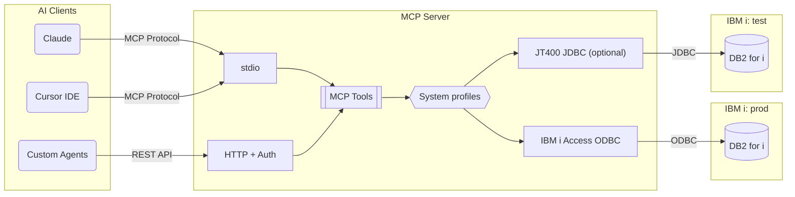

# mcp-server-db2i

[](https://github.com/Strom-Capital/mcp-server-db2i/actions/workflows/ci.yml)
[](https://www.npmjs.com/package/mcp-server-db2i)
[](https://opensource.org/licenses/MIT)
[](https://modelcontextprotocol.io/)
[](https://www.ibm.com/products/ibm-i)
[](https://www.typescriptlang.org/)
[](https://nodejs.org/)
[](docs/docker.md)
[](https://www.npmjs.com/package/mcp-server-db2i)
[](https://github.com/Strom-Capital/mcp-server-db2i/pulls)
[](https://github.com/Strom-Capital/mcp-server-db2i/commits/main)

A [Model Context Protocol (MCP)](https://modelcontextprotocol.io/) server for IBM DB2 for i (DB2i). This server enables AI assistants like Claude and Cursor to query and inspect IBM i databases through the IBM i Access ODBC driver, or optionally the JT400 JDBC driver.

Listed in the [MCP Registry](https://registry.modelcontextprotocol.io/) as `io.github.Strom-Capital/mcp-server-db2i`.

## Architecture

AI clients connect to the MCP Server via stdio (IDEs) or HTTP (agents), which executes read-only queries against DB2 for i using the IBM i Access ODBC driver (default, no Java) or the optional JT400 JDBC driver (`DB2I_DRIVER=jt400`). One server can reach several IBM i systems through connection profiles, each with its own driver.



## Features

- **Read-only SQL queries** - Execute SELECT statements safely with automatic result limiting
- **Schema inspection** - List all schemas/libraries with optional filtering
- **Table metadata** - List tables, describe columns, view indexes and constraints
- **View inspection** - List and explore database views
- **Secure by design** - Only SELECT queries allowed, credentials via environment variables
- **Docker support** - Run as a container for easy deployment
- **HTTP Transport** - REST API with token authentication for web/agent integration
- **Current MCP spec** - Speaks [2026-07-28](https://modelcontextprotocol.io/) and still serves stateless 2025-era clients
- **Dual Transport** - Run stdio and HTTP simultaneously
- **Multiple systems** - Reach several IBM i systems from one server with `DB2I_PROFILES`, each with its own driver, credentials, and library allowlist. Tools take an optional `system` argument. See [Multiple systems](docs/configuration.md#multiple-systems)
- **Tool selection** - Enable or disable individual tools, e.g. a metadata-only mode without `execute_query`
- **Business SQL tools** - Load read-only ERP queries and table notes from YAML, and check the files with `mcp-server-db2i validate-tools` before the server starts. See [Business SQL tools](docs/custom-tools.md)
- **Compact responses** - Compact JSON by default, or markdown tables to save tokens
- **Statement checks and DDL** - Validate object names, return the SQL that recreates an object, and list what depends on a table
- **Catalog search and profiling** - Find tables and columns across libraries, check journaling, and profile a table's row counts and value ranges
- **Column masking** - Redact sensitive columns, or show only their last four characters, in query results. See [Column masking](docs/security.md#column-masking)
- **Audit log** - Record every tool call as one JSON line, with the SQL hashed by default. See [Audit log](docs/security.md#audit-log)
- **Tool reload** - Reload YAML tool files when they change, with `MCP_CUSTOM_TOOLS_WATCH=true`
- **Resources and prompts** - Read table columns and DDL as MCP resources, and start from prompts that explore a library, explain a table, or write a query. See [Resources and prompts](#resources-and-prompts)

## Quick Start

### Installation

```bash
npm install -g mcp-server-db2i
```

The default `odbc` driver needs unixODBC and the IBM i Access ODBC Driver on the machine. No Java is needed. To use the JT400 JDBC driver instead, have a JDK installed when you run `npm install` and set `DB2I_DRIVER=jt400`. See [Database Drivers](docs/configuration.md#database-drivers).

Or with Docker:

```bash
docker build -t mcp-server-db2i .                  # odbc image (amd64; add --platform linux/amd64 on arm64)
docker build --target jt400 -t mcp-server-db2i .   # jt400 image (builds natively on arm64)
```

### Configuration

Create a `.env` file with your IBM i credentials:

```env
DB2I_HOSTNAME=your-ibm-i-host.com
DB2I_USERNAME=your-username
DB2I_PASSWORD=your-password
DB2I_SCHEMA=your-default-schema  # Optional
```

### Client Setup

Add to your MCP client config (e.g., `~/.cursor/mcp.json`):

```json
{
  "mcpServers": {
    "db2i": {
      "command": "npx",
      "args": ["mcp-server-db2i"],
      "env": {
        "DB2I_HOSTNAME": "${env:DB2I_HOSTNAME}",
        "DB2I_USERNAME": "${env:DB2I_USERNAME}",
        "DB2I_PASSWORD": "${env:DB2I_PASSWORD}"
      }
    }
  }
}
```

This uses environment variable expansion to keep credentials out of config files. Set the variables in your shell profile (`~/.zshrc` or `~/.bashrc`).

See the [Client Setup Guide](docs/client-setup.md) for Cursor, Claude Desktop, Claude Code, and Docker setup options.

## Available Tools

| Tool | Description |
|------|-------------|
| `execute_query` | Execute read-only SELECT queries |
| `list_schemas` | List schemas/libraries (with optional filter) |
| `list_tables` | List tables in a schema (with optional filter) |
| `search_tables` | Find tables by name or description across libraries |
| `search_columns` | Find columns by name or description across libraries |
| `describe_table` | Get detailed column information |
| `list_views` | List views in a schema (with optional filter) |
| `list_indexes` | List SQL indexes for a table |
| `get_table_constraints` | Get primary keys, foreign keys, unique constraints |
| `validate_query` | Check a statement without running it, including catalog names |
| `get_object_ddl` | Return the SQL DDL that recreates an object |
| `get_related_objects` | List objects that depend on a table |
| `get_journal_info` | List journal, images, and primary key per table, and flag tables a replication tool cannot read |
| `profile_table` | Row count, last change, and per-column distinct and null counts from stored statistics or a scan |
| `get_business_context` | List business descriptions and relations loaded from YAML |

### Filter Syntax

The list tools support pattern matching:
- `CUST` - Contains "CUST"
- `CUST*` - Starts with "CUST"
- `*LOG` - Ends with "LOG"

## Resources and prompts

Clients that support MCP resources can read a table's context without a tool call, and complete library and table names as you type.

| Resource | Contents | Registered when |
|----------|----------|-----------------|
| `db2i://{schema}/{table}` | Columns from the catalog, plus the YAML business description, column notes, and relations | `describe_table` is enabled |
| `db2i://{schema}/{table}/ddl` | SQL from `QSYS2.GENERATE_SQL` that recreates the table, view, or alias | `get_object_ddl` is enabled |
| `db2i://business-context` | Every annotation loaded from `MCP_CUSTOM_TOOLS` | `get_business_context` is enabled |

`resources/list` offers the annotated tables, for example `db2i://MYLIB/ORDERS`. Percent-encode `#` and other reserved characters in names (`ORD%23X` for `ORD#X`). A library outside `QUERY_ALLOWED_SCHEMAS` is rejected with the same message `execute_query` gives, and completion offers only allowed libraries. Reads and completions that query IBM i count against the rate limit, and reads are written to the audit log. Completion fetches a library's name list once and reuses it for 60 seconds, so typing a name costs one query rather than one per keystroke.

| Prompt | Arguments | What it asks for |
|--------|-----------|------------------|
| `explore_library` | `schema` | List the tables, describe the central ones, and summarize how they join |
| `explain_table` | `schema`, `table` | Explain rows, columns, keys, and relations in plain language |
| `write_query` | `question`, `schema`, `table` | Write one SELECT from the table's real columns and YAML relations, then validate and run it when those tools are enabled |

A prompt is listed only when the tools it tells the model to call are enabled: `explore_library` needs `list_tables` and `describe_table`, and the other two need `describe_table`. None of them asks for a write.

## Use cases

I've used this server on projects where the source system was the Iptor DC1 ERP on IBM i. The same patterns work with any IBM i ERP.

- **Building REST APIs** - The agent finds the ERP tables and keys, checks its SQL with `validate_query`, tests it on sample rows, and then writes the endpoint.
- **ETL and ELT pipelines for BI** - Profile source tables, generate staging DDL with `get_object_ddl`, and draft incremental extracts and code mappings for the warehouse.
- **Near-real-time replication to BI** - Check which tables are journaled, and with which images, before a journal-based tool such as Fivetran streams changes to the warehouse.
- **Ad-hoc analysis** - Connect Claude or Cursor directly to the ERP and ask business questions in plain language, with vetted Business SQL tools and column masking for sensitive fields.

See [Use cases](docs/use-cases.md) for sample prompts and the guardrails that go with each one.

## Example Usage

Once connected, you can ask the AI assistant:

- "List all schemas that contain 'PROD'"
- "Show me the tables in schema MYLIB"
- "Describe the columns in MYLIB/CUSTOMERS"
- "What indexes exist on the ORDERS table?"
- "Run this query: SELECT * FROM MYLIB.CUSTOMERS WHERE STATUS = 'A'"
- "Find the order header and line tables in MYLIB and write a GET /orders/:orderNo endpoint"
- "Draft an incremental extract of MYLIB.ORDERHDR rows changed since yesterday"

## Documentation

| Guide | Description |
|-------|-------------|
| [HTTP Transport](docs/http-transport.md) | HTTP API, auth, and protocol versions |
| [Configuration](docs/configuration.md) | All environment variables and driver options |
| [Security](docs/security.md) | Credentials, rate limiting, query validation |
| [Business SQL tools](docs/custom-tools.md) | YAML tools for orders, ledgers, and master data |
| [Use cases](docs/use-cases.md) | REST APIs, BI pipelines, replication, and ad-hoc analysis |
| [Client Setup](docs/client-setup.md) | Cursor, Claude, Claude Code setup |
| [Docker Guide](docs/docker.md) | Container deployment |
| [Development](docs/development.md) | Contributing and local setup |

## Compatibility

- IBM i V7R3 and later (V7R5 recommended)
- `validate_query` and the `execute_query` parse check need `QSYS2.PARSE_STATEMENT` (IBM i 7.3 with Db2 PTF group SF99703 level 3, or 7.4 and later)
- `get_related_objects` needs IBM i 7.3 Technology Refresh 9, IBM i 7.4 Technology Refresh 3, or a later release
- `get_journal_info` needs the journal columns of `QSYS2.OBJECT_STATISTICS` (IBM i 7.3 Technology Refresh 2 or later)
- Node.js 22 or higher
- unixODBC with the IBM i Access ODBC Driver for the default `odbc` driver, or a JDK at install time and a JRE 11 or higher at runtime for the optional `jt400` driver (see [Database Drivers](docs/configuration.md#database-drivers))
- MCP spec 2026-07-28, plus stateless clients from the 2025-era revisions (through 2025-11-25)

## Related Projects

- **[IBM ibmi-mcp-server](https://github.com/IBM/ibmi-mcp-server)** - IBM's official MCP server for IBM i systems. Offers YAML-based SQL tool definitions and AI agent frameworks. Requires [Mapepire](https://mapepire-ibmi.github.io/).

## Contributing

Contributions are welcome! See the [Development Guide](docs/development.md) for setup instructions.

## License

MIT License - see [LICENSE](LICENSE) for details.

## Acknowledgments

- [node-jt400](https://www.npmjs.com/package/node-jt400) - JT400 JDBC driver wrapper for Node.js
- [node-odbc](https://github.com/IBM/node-odbc) - ODBC bindings for Node.js, maintained by IBM
- [Model Context Protocol](https://modelcontextprotocol.io/) - The protocol specification
- [@modelcontextprotocol/server](https://github.com/modelcontextprotocol/typescript-sdk) - Official TypeScript SDK (spec 2026-07-28, with stateless 2025-era clients)
