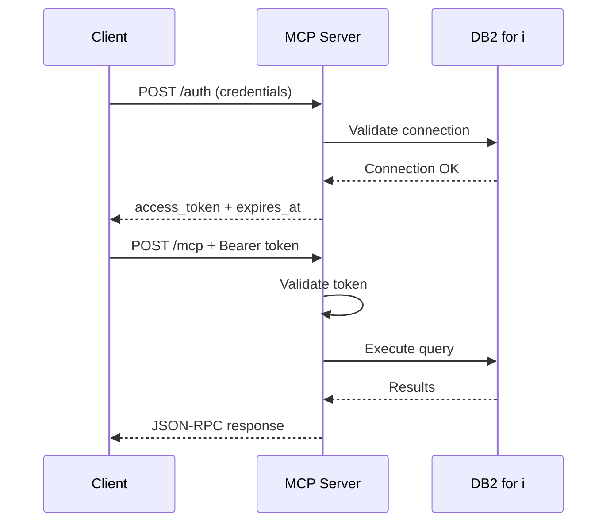

# HTTP Transport

The server supports HTTP transport for web and agent integration, in addition to the default stdio transport.

## Enabling HTTP Mode

Set the `MCP_TRANSPORT` environment variable:

```bash
# HTTP only
MCP_TRANSPORT=http

# Both stdio and HTTP (for development/testing)
MCP_TRANSPORT=both

# Default: stdio only (for CLI/IDE integration)
MCP_TRANSPORT=stdio
```

## Configuration

| Variable | Default | Description |
|----------|---------|-------------|
| `MCP_TRANSPORT` | `stdio` | Transport mode: `stdio`, `http`, or `both` |
| `MCP_HTTP_PORT` | `3000` | HTTP server port |
| `MCP_HTTP_HOST` | `127.0.0.1` | Bind address. Use `0.0.0.0` when Docker publishes the port or another container connects. Put TLS on this process or on the proxy in front of it |
| `MCP_ALLOWED_HOSTS` | loopback | Extra `Host` names, comma-separated. Loopback is always allowed. Required for a public hostname when the process binds `0.0.0.0` |
| `MCP_SESSION_MODE` | `stateless` | `stateless` (default) or deprecated `stateful` |
| `MCP_AUTH_MODE` | `required` | Authentication mode: `required`, `token`, or `none` |
| `MCP_AUTH_TOKEN` | - | Static token for `token` auth mode |
| `MCP_ALLOW_UNAUTHENTICATED_HTTP` | `false` | Allow `none` when the bind address is not loopback |
| `MCP_AUTH_ALLOWED_DB_HOSTS` | `DB2I_HOSTNAME` | Hosts `POST /auth` may connect to |
| `MCP_TLS_ENABLED` | `false` | Enable built-in TLS |
| `MCP_TLS_CERT_PATH` | - | Path to TLS certificate (required if TLS enabled) |
| `MCP_TLS_KEY_PATH` | - | Path to TLS private key (required if TLS enabled) |
| `MCP_TOKEN_EXPIRY` | `3600` | Token lifetime in seconds (for `required` mode) |
| `MCP_MAX_SESSIONS` | `100` | Maximum concurrent sessions |
| `MCP_CORS_ORIGINS` | - | CORS allowed origins (comma-separated, `*` for all) |
| `DB2I_HOSTNAME` | - | IBM i hostname (fallback for auth requests) |
| `DB2I_SCHEMA` | - | Default schema (fallback for auth requests) |

## Authentication Modes

The server supports three authentication modes for HTTP transport:

### Required Mode (default, most secure)

```bash
MCP_AUTH_MODE=required
```

Full `/auth` flow with per-user DB credentials:
- Users must authenticate via POST `/auth` with their IBM i credentials
- Each user gets their own database connection with their permissions
- Tokens expire based on `MCP_TOKEN_EXPIRY`

This is the default and most secure option, ideal for multi-user environments.

### Token Mode (simpler integration)

```bash
MCP_AUTH_MODE=token
MCP_AUTH_TOKEN=your-secret-token-here
```

Pre-shared static token using environment DB credentials:
- All requests use the same Bearer token
- Database connection uses `DB2I_*` environment variables
- No per-user authentication

Generate a secure token:
```bash
openssl rand -hex 32
```

**Security Note:** Always use HTTPS with token mode to protect the token in transit.

### None Mode (trusted networks only)

```bash
MCP_AUTH_MODE=none
```

No authentication required:
- `/mcp` endpoints are accessible without any authentication
- Database connection uses `DB2I_*` environment variables
- `/auth` endpoint returns 404

**Warning:** Only use this mode on trusted networks (localhost, internal VPNs) or for development/testing. The process will not listen on a non-loopback address in this mode unless `MCP_ALLOW_UNAUTHENTICATED_HTTP=true`.

Requests whose `Host` header is not loopback and not listed in `MCP_ALLOWED_HOSTS` are rejected with 403. Set `MCP_ALLOWED_HOSTS` to the name clients use when the server is published beyond localhost.

In `required` mode, the `host` field on `POST /auth` must be `DB2I_HOSTNAME` or a name in `MCP_AUTH_ALLOWED_DB_HOSTS`. Other hosts are rejected before a connection is opened.

## Authentication Flow (Required Mode)

HTTP mode uses token-based authentication. You must first obtain a token by posting credentials, then use that token for subsequent MCP requests.



### Step 1: Get a Token

Post credentials to `/auth`:

```bash
curl -X POST http://localhost:3000/auth \
  -H "Content-Type: application/json" \
  -d '{
    "username": "MYUSER",
    "password": "mypassword",
    "host": "ibmi.example.com",
    "schema": "MYLIB"
  }'
```

Response:

```json
{
  "access_token": "abc123...",
  "token_type": "Bearer",
  "expires_in": 3600,
  "expires_at": "2026-01-18T15:00:00.000Z"
}
```

### Step 2: Use the Token

Include the token in the `Authorization` header for MCP requests:

```bash
curl -X POST http://localhost:3000/mcp \
  -H "Content-Type: application/json" \
  -H "Authorization: Bearer abc123..." \
  -d '{
    "jsonrpc": "2.0",
    "method": "tools/call",
    "params": {
      "name": "list_schemas",
      "arguments": {}
    },
    "id": 1
  }'
```

## Auth Request Fields

| Field | Required | Description |
|-------|----------|-------------|
| `username` | Yes | IBM i username |
| `password` | Yes | IBM i password |
| `host` | No | IBM i hostname (falls back to `DB2I_HOSTNAME`) |
| `port` | No | Accepted for compatibility. Not used by either driver |
| `database` | No | Accepted for compatibility. Not used by either driver |
| `schema` | No | Default schema (falls back to `DB2I_SCHEMA`) |
| `duration` | No | Token lifetime in seconds. Capped at `MCP_TOKEN_EXPIRY` |
| `system` | No | Profile from `DB2I_PROFILES` to log in to (default: the first). Not accepted with `host`, `port`, or `database` |

## Multiple Systems

With [`DB2I_PROFILES`](configuration.md#multiple-systems) set, a login in `required` mode picks a system:

```bash
curl -X POST http://localhost:3000/auth \
  -H "Content-Type: application/json" \
  -d '{"username": "MYUSER", "password": "mypassword", "system": "test"}'
```

The host, port, database, driver, and driver options come from the `test` profile. The username and password come from the request, and the server tests them on that system before it returns a token. The token is bound to that system:

- Tools on that token have no `system` argument, and every call runs on `test`.
- Business SQL tools fixed to another system with `system:` are not listed.
- To use another system, log in again with its name.

`host`, `port`, and `database` are refused while `DB2I_PROFILES` is set, because the profile supplies them. When `MCP_AUTH_ALLOWED_DB_HOSTS` is unset, `/auth` may connect only to the profile hosts. When it is set, a profile whose host is not in the list cannot be used.

In `token` and `none` modes there is no login, so every caller can reach every profile, and each call picks one with the `system` argument. Each caller runs as the profile's configured user.

## API Endpoints

| Method | Path | Auth | Description |
|--------|------|------|-------------|
| GET | `/openapi.json` | None | OpenAPI 3.1 specification |
| POST | `/auth` | None | Exchange credentials for token (`required` mode only) |
| GET | `/health` | None | Health check with session stats and config |
| POST | `/mcp` | Depends on mode* | MCP JSON-RPC requests (2026-07-28 and 2025-era) |
| GET | `/mcp` | Depends on mode* | SSE stream (deprecated `stateful` mode only; otherwise 405) |
| DELETE | `/mcp` | Depends on mode* | Close MCP session (deprecated `stateful` mode only; otherwise 405) |

*Authentication depends on `MCP_AUTH_MODE`:
- `required`: Bearer token from `/auth`
- `token`: Static Bearer token from `MCP_AUTH_TOKEN`
- `none`: No authentication required

**API Documentation**: Import `/openapi.json` into [Postman](https://learning.postman.com/docs/design-apis/specifications/import-a-specification/), Insomnia, or other API clients for interactive exploration.

## Protocol versions

HTTP serves two protocol eras from the same `/mcp` endpoint:

- **2026-07-28** (current). No `initialize` handshake and no `Mcp-Session-Id`. Each request carries a `_meta` envelope (`io.modelcontextprotocol/protocolVersion`, client info, capabilities) plus `MCP-Protocol-Version`, `Mcp-Method`, and (for named calls) `Mcp-Name`. `server/discover` replaces `initialize`.
- **2025-era** (through 2025-11-25). Stateless by default: each `initialize` / `tools/call` is its own request. `GET` and `DELETE /mcp` answer `405`.

Database connection pools are keyed by the auth token (or one shared pool in `token` / `none` mode), so dropping protocol sessions does not mix users' IBM i credentials.

## Session Modes

### Stateless (default)

Each HTTP request builds a fresh MCP server on the caller's existing database pool. This is the mode 2026-07-28 clients use, and it also serves 2025-era clients without `Mcp-Session-Id`.

### Stateful (deprecated)

Set `MCP_SESSION_MODE=stateful` only when a 2025-era client requires `Mcp-Session-Id`, `GET /mcp`, or `DELETE /mcp`. The process logs a deprecation warning. 2026-07-28 requests on the same endpoint stay stateless. Database pools are still keyed by the auth token, not by that session id.

## TLS Configuration

For production deployments, enable TLS or run behind a reverse proxy with TLS termination.

### Built-in TLS

```bash
MCP_TLS_ENABLED=true
MCP_TLS_CERT_PATH=/path/to/cert.pem
MCP_TLS_KEY_PATH=/path/to/key.pem
```

### Reverse Proxy (recommended)

Run behind nginx, Caddy, or a cloud load balancer that handles TLS termination. The server can bind to localhost:

```bash
MCP_HTTP_HOST=127.0.0.1
MCP_HTTP_PORT=3000
```

## Security Considerations

- **Use `required` mode in production**: Provides per-user authentication and database permissions
- **Use HTTPS in production**: Enable TLS or run behind a reverse proxy
- **Token expiry**: In `required` mode, tokens expire after 1 hour by default (configurable via `MCP_TOKEN_EXPIRY`)
- **Rate limiting**: The `/auth` endpoint has built-in rate limiting to prevent brute force attacks
- **Token mode requires HTTPS**: When using `token` mode, always enable TLS to protect the static token
- **None mode for trusted networks only**: Only use `none` mode on localhost or secure internal networks
- **Session limits**: Maximum concurrent sessions configurable via `MCP_MAX_SESSIONS`

### Auth Mode Security Comparison

| Mode | User Isolation | Credential Security | Use Case |
|------|----------------|---------------------|----------|
| `required` | Per-user DB permissions | Credentials per request | Production multi-user |
| `token` | Shared DB user | Static token in env | Internal services, CI/CD |
| `none` | Shared DB user | None | Development, localhost |

## Example: Complete Workflow

```bash
# 1. Start server in HTTP mode
MCP_TRANSPORT=http npm run dev

# 2. Authenticate
TOKEN=$(curl -s -X POST http://localhost:3000/auth \
  -H "Content-Type: application/json" \
  -d '{"username":"MYUSER","password":"mypass","host":"ibmi.example.com"}' \
  | jq -r '.access_token')

# 3. Discover the server (spec 2026-07-28). No session id.
curl -X POST http://localhost:3000/mcp \
  -H "Content-Type: application/json" \
  -H "Accept: application/json, text/event-stream" \
  -H "Authorization: Bearer $TOKEN" \
  -H "MCP-Protocol-Version: 2026-07-28" \
  -H "Mcp-Method: server/discover" \
  -d '{"jsonrpc":"2.0","id":1,"method":"server/discover","params":{"_meta":{"io.modelcontextprotocol/protocolVersion":"2026-07-28","io.modelcontextprotocol/clientInfo":{"name":"curl","version":"1.0"},"io.modelcontextprotocol/clientCapabilities":{}}}}'

# 4. Call a tool on the same stateless endpoint
curl -X POST http://localhost:3000/mcp \
  -H "Content-Type: application/json" \
  -H "Accept: application/json, text/event-stream" \
  -H "Authorization: Bearer $TOKEN" \
  -H "MCP-Protocol-Version: 2026-07-28" \
  -H "Mcp-Method: tools/call" \
  -H "Mcp-Name: list_schemas" \
  -d '{"jsonrpc":"2.0","id":2,"method":"tools/call","params":{"name":"list_schemas","arguments":{"filter":"QSYS*"},"_meta":{"io.modelcontextprotocol/protocolVersion":"2026-07-28","io.modelcontextprotocol/clientInfo":{"name":"curl","version":"1.0"},"io.modelcontextprotocol/clientCapabilities":{}}}}'
```
