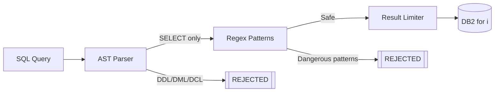

# Security

This guide covers security features and best practices for mcp-server-db2i.

## Security Features

- **Read-only access**: Only SELECT statements are permitted, and the driver connection is opened read only (JDBC `access=read only`, ODBC `CONNTYPE=2`) unless `DB2I_JDBC_OPTIONS` sets `access` or `DB2I_ODBC_OPTIONS` sets `CONNTYPE`
- **No credentials in code**: All sensitive data via environment variables or file-based secrets
- **Query validation**: AST-based SQL parsing plus regex validation blocks dangerous operations
- **Result limiting**: Default limit of 1000 rows, configurable max limit (default: 10000)
- **Rate limiting**: Configurable request throttling to prevent abuse (100 req/15 min default)
- **Structured logging**: Automatic redaction of sensitive fields like passwords
- **HTTP auth**: `required` (per-user credentials via `/auth`), `token` (static bearer), or `none` (trusted networks)

## Credential Management

The server supports multiple methods for providing credentials, listed from most to least secure.

A [`DB2I_PROFILES`](configuration.md#multiple-systems) file never holds a password. Each profile's `password` must be a `"${ENV_VAR}"` reference, or `passwordFile` must point at a file such as a Docker secret. The server refuses to start if a profile has a literal password.

### Option 1: Docker Secrets (Recommended for Production)

Docker secrets provide the most secure credential management. Secrets are mounted as files and never exposed in environment variables or process listings.

1. Create secret files:

```bash
mkdir -p ./secrets
echo "your-username" > ./secrets/db2i_username.txt
echo "your-password" > ./secrets/db2i_password.txt
chmod 600 ./secrets/*.txt
```

2. Configure docker-compose.yml to use secrets:

```yaml
services:
  mcp-server-db2i:
    # ... other config ...
    environment:
      - DB2I_HOSTNAME=${DB2I_HOSTNAME}
      - DB2I_USERNAME_FILE=/run/secrets/db2i_username
      - DB2I_PASSWORD_FILE=/run/secrets/db2i_password
    secrets:
      - db2i_username
      - db2i_password

secrets:
  db2i_username:
    file: ./secrets/db2i_username.txt
  db2i_password:
    file: ./secrets/db2i_password.txt
```

For Docker Swarm or Kubernetes, use their native secret management instead of file-based secrets.

### Option 2: External Secret Management

For enterprise deployments, integrate with secret management systems:

- **HashiCorp Vault**: Inject secrets at runtime
- **AWS Secrets Manager**: Use IAM roles for access
- **Azure Key Vault**: Integrate with managed identities
- **Google Secret Manager**: Use service account authentication

These systems can populate the `*_FILE` environment variables or inject secrets directly.

### Option 3: Environment Variables (Development Only)

Plain environment variables are convenient for development but expose credentials through:
- `docker inspect` output
- Process listings (`ps aux`)
- Shell history
- Log files

```bash
# .env file (ensure it's in .gitignore)
DB2I_USERNAME=your-username
DB2I_PASSWORD=your-password
```

**Warning**: Never commit `.env` files or credentials to version control.

### File-Based Secret Variables

| Variable | Description |
|----------|-------------|
| `DB2I_USERNAME_FILE` | Path to file containing username (takes priority over `DB2I_USERNAME`) |
| `DB2I_PASSWORD_FILE` | Path to file containing password (takes priority over `DB2I_PASSWORD`) |

## Rate Limiting

The server includes built-in rate limiting to protect the IBM i database from excessive queries.

### Configuration

| Variable | Default | Description |
|----------|---------|-------------|
| `RATE_LIMIT_WINDOW_MS` | `900000` | Time window in milliseconds (15 min) |
| `RATE_LIMIT_MAX_REQUESTS` | `100` | Maximum requests per window |
| `RATE_LIMIT_ENABLED` | `true` | Set to `false` to disable |

### Behavior

- **Default**: 100 requests per 15-minute window
- **Scope**: Per server instance (for stdio transport, this means per-client since each MCP client spawns its own server process)
- **HTTP transport**: Rate limiting applies per authenticated token

When the rate limit is exceeded, queries return an error with `waitTimeSeconds` indicating when to retry:

```json
{
  "success": false,
  "error": "Rate limit exceeded",
  "waitTimeSeconds": 120,
  "limit": 100,
  "windowMs": 900000
}
```

## Query Validation

The server validates all SQL queries before execution using multiple layers:



### AST-based Validation

Queries are parsed into an Abstract Syntax Tree (AST) to verify:
- Only SELECT statements are allowed
- No DDL (CREATE, ALTER, DROP)
- No DML (INSERT, UPDATE, DELETE)
- No DCL (GRANT, REVOKE)

### Regex Validation

Additional regex patterns block:

- Command execution attempts
- System procedure calls
- Dangerous functions, including schema-qualified calls. The check uses the unqualified name
- IBM i services that send data off the system or write outside the database: HTTP services, IFS write services, spreadsheet generation, and email

Before the keyword scan, string literals, comments, and the quotes around delimited identifiers are removed. A literal or a quoted name earlier in the statement cannot hide a later call. Words that appear only inside a literal or a comment are ignored.

The driver connection is a second layer. JT400 uses `access=read only` unless `DB2I_JDBC_OPTIONS` sets `access`; the ODBC driver uses `CONNTYPE=2` unless `DB2I_ODBC_OPTIONS` sets `CONNTYPE`. An explicit override is logged at startup.

### Statement parse check

`execute_query` asks IBM i to parse the statement with `QSYS2.PARSE_STATEMENT` before it runs. The query is rejected when the statement does not parse, or when it is not a query. This catches Db2 for i syntax that the local parser accepts.

The check is on unless `QUERY_PARSE_CHECK` is `false` or `0`. It adds one round trip, often a few hundred milliseconds, on every `execute_query` call. Business SQL tools run the same check the first time each tool is called, then cache the result. If `QSYS2.PARSE_STATEMENT` is not installed, the query is rejected and the error tells you to turn the check off. A missing function does not skip the check on its own.

`validate_query` runs the same parse, then checks tables, columns, and qualified routines against the catalog. It reports findings and does not execute the statement.

`get_object_ddl` calls `QSYS2.GENERATE_SQL` on a separate connection that is not marked read-only, because that procedure is rejected on a read-only connection. That connection runs only the procedure call. It does not execute the DDL it returns. The connection used by `execute_query` stays read-only.

### Result Limiting

Query results are automatically limited to prevent memory exhaustion:

| Variable | Default | Description |
|----------|---------|-------------|
| `QUERY_DEFAULT_LIMIT` | `1000` | Applied when no limit specified |
| `QUERY_MAX_LIMIT` | `10000` | Maximum allowed (caps user limits) |

### Metadata-Only Mode

If clients only need to browse schemas, tables, and columns, turn off free-form SQL entirely:

```bash
MCP_TOOLS_DISABLED=execute_query
```

The tool is then never registered, so validation bypasses cannot reach it. Business SQL tools loaded from `MCP_CUSTOM_TOOLS` stay available, and they go through the same read-only check, schema allowlist, and parse check. See [Business SQL tools](custom-tools.md). See [Tool Selection](configuration.md#tool-selection) for the full allowlist and denylist syntax.

### Schema Allowlist

`QUERY_ALLOWED_SCHEMAS` rejects an `execute_query` call whose tables are outside that list. The check runs after the read-only validation and before the parse check and the query. The same list applies to `validate_query`, `get_object_ddl`, `get_related_objects`, `get_journal_info`, `profile_table`, the catalog browsing tools (`list_tables`, `describe_table`, `list_views`, `list_indexes`, `get_table_constraints`), the resources and prompts, and business SQL tools. `list_schemas` returns only libraries in the list. `get_related_objects` omits dependents whose schema is outside the list. A business tool that fails the check is rejected at startup, and again when it is called.

- Unqualified names resolve to the session schema, or to `DB2I_SCHEMA` when the session has none. If that schema is missing or not in the list, the query is rejected.
- The list comes from the server environment. A schema chosen at `/auth` changes where unqualified names resolve. It does not add libraries to the list.
- With [`DB2I_PROFILES`](configuration.md#multiple-systems), each profile can set its own `allowedSchemas`. A profile without one uses `QUERY_ALLOWED_SCHEMAS`. Every call is checked against the list of the system it runs on.
- Queries that cannot be parsed are rejected while the list is set. System naming (`LIB/FILE`) and `TABLE(...)` table functions fall into that group.
- `QSYS2` and `SYSIBM` are allowed only when you add them.

This does not replace IBM i object authority. A view or alias in an allowed library can still point at another library. Use a user profile that has access only to the libraries in the list.

## HTTP Transport Security

When using HTTP transport, additional security measures apply:

### Authentication

- **`required`** (default): clients exchange IBM i credentials at `POST /auth`. Those credentials are not taken from the environment. Tokens expire after 1 hour by default (`MCP_TOKEN_EXPIRY`).
- **`token`** and **`none`**: the server uses `DB2I_*` environment credentials. `token` still requires `MCP_AUTH_TOKEN`. Use `none` only on a trusted network. A non-loopback bind with `MCP_AUTH_MODE=none` refuses to start unless `MCP_ALLOW_UNAUTHENTICATED_HTTP=true`.

`POST /auth` opens a database connection to test the credentials. By default that host must be `DB2I_HOSTNAME`. Set `MCP_AUTH_ALLOWED_DB_HOSTS` to a comma-separated list to allow more than one. When neither value is set, any host is accepted and a warning is logged. A rejected host returns 400 and does not open a connection. It still counts toward the `/auth` rate limit.

Every request is checked against an allowlist of `Host` values before it is routed. Loopback names are always allowed. Add public names with `MCP_ALLOWED_HOSTS` when the server is reached by a hostname other than the bind address. A rejected `Host` returns 403. The rejected value is logged and is not echoed in the response. This blocks a page that rebinds its name onto the loopback address and sends that name in both `Host` and `Origin`.

Browser requests with an `Origin` header must be same-origin or listed in `MCP_CORS_ORIGINS`. Others get 403. A listed origin is echoed in `Access-Control-Allow-Origin` with `Vary: Origin`, and `MCP_CORS_ORIGINS='*'` answers with a literal `*`. The server never sends `Access-Control-Allow-Credentials`, because tokens travel in the `Authorization` header rather than in cookies.

See [HTTP Transport](http-transport.md) for the request shapes. Protocol sessions (`Mcp-Session-Id`) are deprecated; pools stay isolated by auth token in the default stateless mode.

### Auth Endpoint Rate Limiting

The `/auth` endpoint has additional rate limiting to prevent brute-force attacks:

| Setting | Value | Description |
|---------|-------|-------------|
| Max attempts | 5 | Maximum attempts before lockout |
| Window | 60 seconds | Time window for tracking attempts |

**Behavior:**
- Authentication attempts are tracked per IP address and counted when they arrive, so parallel requests cannot get past the limit while earlier attempts are still testing their credentials
- After 5 attempts within 60 seconds, further requests from that IP get 429 until the window ends
- Successful authentication clears the count for that IP
- Lockout automatically expires after the window period

> **Note:** These values are currently hardcoded. Environment variable configuration may be added in a future release.

### TLS/HTTPS

For production HTTP deployments:

```bash
# Enable built-in TLS
MCP_TLS_ENABLED=true
MCP_TLS_CERT_PATH=/path/to/cert.pem
MCP_TLS_KEY_PATH=/path/to/key.pem
```

Or run behind a reverse proxy (nginx, Caddy, cloud load balancer) that handles TLS termination.

### Session Limits

Control concurrent sessions to prevent resource exhaustion:

```bash
MCP_MAX_SESSIONS=100  # Maximum concurrent sessions
```

## Column masking

Db2 row and column access control (RCAC) is the control that actually holds. A mask in this server only changes what an agent receives from `execute_query`, from YAML tools, and from `profile_table`. It does not change what the database user can read with another client.

Rules live in the YAML `masking` section described in [Business SQL tools](custom-tools.md#masking). `redact` replaces a value. `last4` keeps the last four characters.

The server rejects a statement that uses a masked column as anything other than a plain selected column, so an alias or `UPPER(EMAIL)` cannot carry the value out under another name. That check needs `QSYS2.PARSE_STATEMENT` for `execute_query`. When masking is loaded and `QUERY_PARSE_CHECK` is off, `execute_query` refuses to run. A mask the server cannot enforce would be worse than no mask. YAML tools are checked from the statement text at load time and do not depend on that setting.

`profile_table` writes its own statements, so the select-list check does not apply to it. It never selects `MIN` or `MAX` of a masked column when it scans, and it drops the stored low and high values of a masked column. Distinct and null counts are still returned, marked with `masked` and the rule. With `compute: true` the generated aggregate goes to the audit log like any other SQL.

`extended metadata=true` in `DB2I_JDBC_OPTIONS` makes JT400 label result keys with `LABEL ON` text instead of the column name. Masking would miss those keys, so the server refuses to start when that option is set and a masking rule is loaded.

A view, an alias, or a table function that reads a masked table is not covered unless the view itself is listed in `masking`.

## Audit log

`MCP_AUDIT_LOG` writes one JSON line for every tool call: who ran it, which tool, a hash of the SQL (or the text when `MCP_AUDIT_SQL=full`), how many parameters were bound, the row count, how long it took, and whether it succeeded, failed, or was rate limited. HTTP calls record the IBM i username. Stdio calls record `stdio`. Each line also records the `system` the call ran on (`default` when `DB2I_PROFILES` is unset), and its `args` leave out the `system` argument.

Resource reads and the `write_query` prompt query the catalog too, so they are recorded the same way. Their `tool` is `resource:table`, `resource:table_ddl`, or `prompt:write_query`, and `args` holds the schema and table. Reading `db2i://business-context` and completing names are not recorded.

Hashing is the default because the statement often contains customer values, and an audit file should not become a second copy of the data. Set `MCP_AUDIT_PARAMS=true` only when you need the bound values and the file is protected like a credential.

The pino log is not this record. At `info` it does not keep the SQL, and at `debug` it is a diagnostic trace, not an answer to who ran what. A failed audit write is reported once and does not fail the tool call.

## Logging Security

The structured logger automatically redacts sensitive fields:

- Passwords are never logged
- Connection strings are sanitized
- Query parameters with sensitive names are masked

### Log Levels

| Level | When to Use |
|-------|-------------|
| `error` | Production (errors only) |
| `warn` | Production (errors + warnings) |
| `info` | Default (normal operations) |
| `debug` | Development/troubleshooting |

In production, use JSON logging for better parsing:

```bash
NODE_ENV=production
LOG_LEVEL=info
```

## Security Checklist

### Production Deployment

- [ ] Use Docker secrets or external secret management
- [ ] Enable TLS for HTTP transport
- [ ] Set `secure=true` in `DB2I_JDBC_OPTIONS` (or `SSL=1` in `DB2I_ODBC_OPTIONS`) after the IBM i host servers are configured for SSL
- [ ] Set `MCP_ALLOWED_HOSTS` to the public hostname when the HTTP server is not loopback-only
- [ ] Leave `access` (JDBC) and `CONNTYPE` (ODBC) unset so the connection stays read only, or treat an explicit value as a deliberate override
- [ ] Set appropriate rate limits
- [ ] Configure query limits
- [ ] Disable tools clients don't need (e.g. `MCP_TOOLS_DISABLED=execute_query`)
- [ ] Set `QUERY_ALLOWED_SCHEMAS` when `execute_query` or business SQL tools are enabled, and limit the IBM i user profile to those libraries
- [ ] Use `info` or higher log level
- [ ] Run as non-root user (Docker image does this by default)
- [ ] Restrict network access to IBM i system
- [ ] Monitor logs for suspicious activity

### Development

- [ ] Use `.env` file (add to `.gitignore`)
- [ ] Enable debug logging if needed
- [ ] Test with production-like rate limits
- [ ] Verify query validation works as expected

## Reporting Security Issues

If you discover a security vulnerability, please report it responsibly:

1. **Do not** open a public GitHub issue
2. Use GitHub's [private vulnerability reporting](https://github.com/Strom-Capital/mcp-server-db2i/security/advisories/new) to submit your report
3. Include steps to reproduce the issue
4. Allow time for a fix before public disclosure
